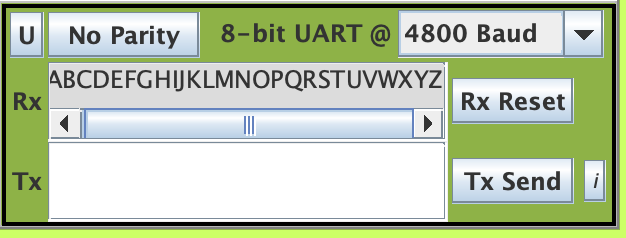

# Operating System 2019 Spring Checkpoint 02

## Preemptive Multithreading
For this programming project checkpoint, you are to write a preemptive multithreading
package and a test case based on the single-buffer producer-consumer example.
Preemptive multithreading means the code for each thread does not need to explicitly do a
thread-yield in order to switch to another thread, if any. Of course, it can also do ThreadYield() if it wants.
Depending on your implementation, you may or may not use a separate thread for the
thread manager. If so, then you may want to define your MAXTHREADS accordingly. All
other API should be the same. Actually, the ThreadYield() function should be available
for preemptive threads, too, because even though the OS can always preempt a thread, a
thread should still be able to voluntarily give up control.

## Todo
1. **Turn in the source files for preemptive multithreading to be compiled using SDCC and targets EdSim51.**
2. testpreempt.c , which contains the startup code and sets up the producer-consumer example.
3. preemptive.c , preemptive.h , which contains the cooperative multithreading code.
4. Turn in the typescript for compiling your code using the provided Makefile.

## Scoring (Check detailed requirments via iLMS)

| **Item**                                         | **Score** |
| :----------------------------------------------: | :-------: |
| testpreempt.c                                    | 25%       |
| preemptive.c                                     | 55%       |
| Typescript for compilation                        | 2%        |
| Screenshots and explanation                      | 18%       |

## Report below here
### Screenchot
</img>
